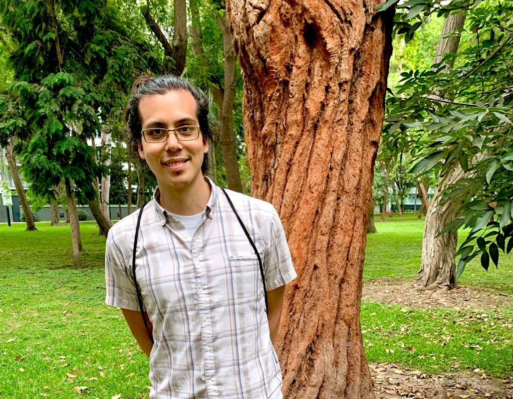

<!-- README.md is generated from README.Rmd. Please edit that file -->

# Hi there 👋

## 🇵🇪 **Andree Valle-Campos** (él/he/his)

## I’m a geneticist skilled in health data science

🏗️ I take **data** problems to learn new **tools** in the route to solve
them, **motivated** by causal questions and **reproducible** research.
<!-- create -->
<!-- reproducible workflows and FAIR principles, reusable software -->
<!-- discussing their interpretation and implications. -->
<!-- satisfy my **own** expectations, and **motivate** myself :) -->

🔓 Continuously integrating **open** science, **software** development
and **teaching** online better practices! <!-- from its *design* -->
<!-- **healthy** work habits -->

🌱 Interested in **quantitative** and **systems** developmental biology,
**bioengineering** approaches, and **configuration** principles.
<!-- 🌱 Interested in **quantitative** systems biology, **developmental** bioengineering, **signaling** and living matter **configuration** principles.  -->

⛑️ This site contains **links** to all my (reusable) scientific
**contributions**. Here is a structured **pdf** version of my
[cv/resume](https://github.com/avallecam/resume/raw/main/cv-andree_vallecampos.pdf)
in english. <!-- in english [EN] and spanish [ES] -->

------------------------------------------------------------------------

## TAKE A LOOK TO MY:

-   [bio](./bio)
-   [resources](./resources) <!-- - [texts](./#texts) -->
    <!-- - [talks](./#talks) --> <!-- - [lectures](./#lectures) -->
    <!-- - [workshops](./#workshops) -->
    <!-- - [about me](./#about-me) -->
